# TUGAS KELOMPOK BASIS DATA( ANTRIAN PASIEN KLINIK)

# NAMA ANGGOTA KELOMPOK 

- Abiyanfaras Danuyasa ( 312210103 )
- Birrham Efendi Lubis ( 312210272 )
- Najwa Iffa Fadhila ( 312210275 )
- Hafidza Dafariz Mujizat ( 312210276)
- Muhammad Zidan Fadillah (312210277)

UNIVERSITAS PELITA BANGSA FAKULTAS TEKNIK TEKNIK INFORMATIKA TAHUN AKADEMIK 2022/2023

Hal yang perlu dibuat : 
• ER-D (312210277/RO/MUHAMMAD ZIDAN FADILLAH) 

• DDL (NAMA) 

• SQL CRUD (NAMA) 

• SQL JOIN (NAMA)

# ERD 

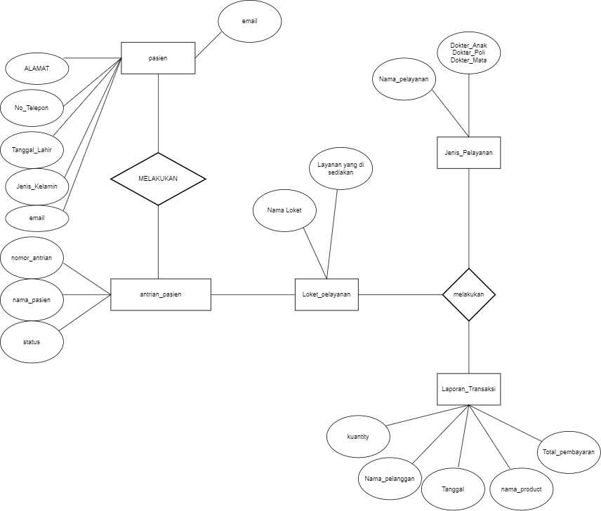

# DLL

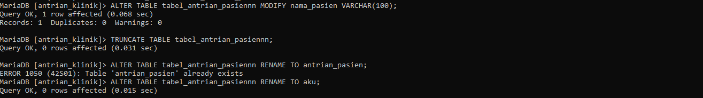

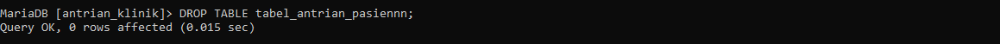

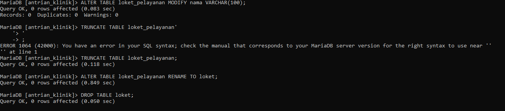

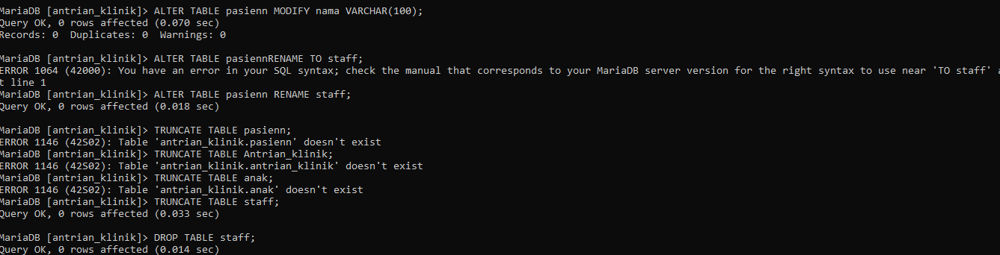

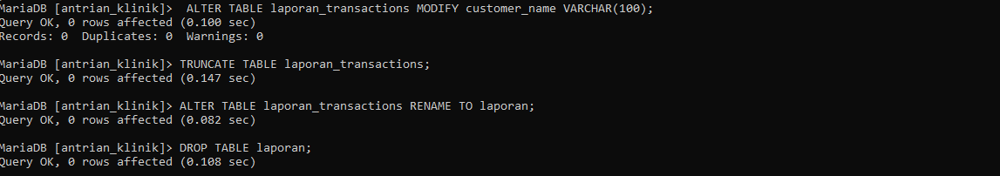

# SQL CURD

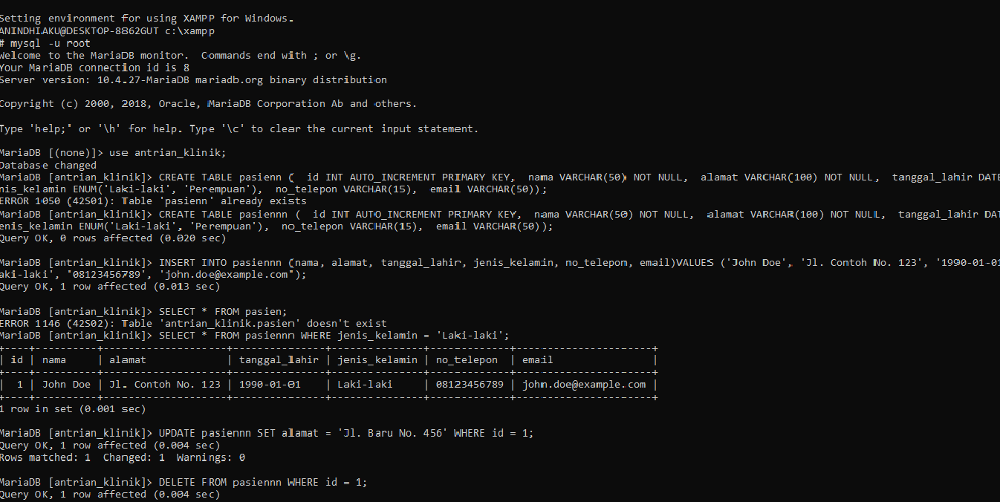

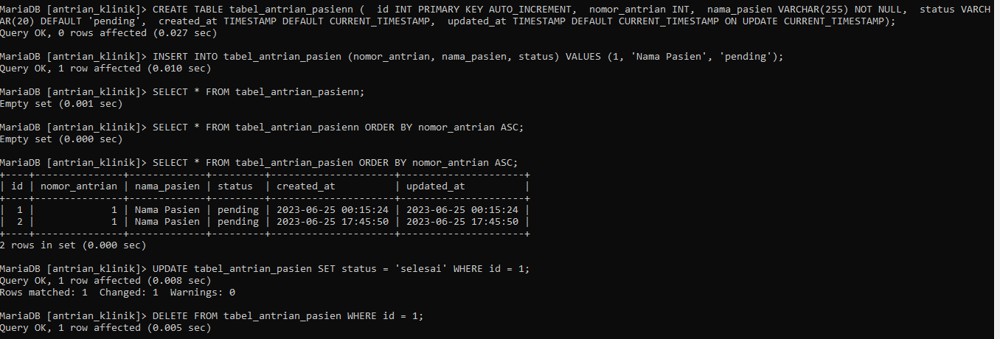

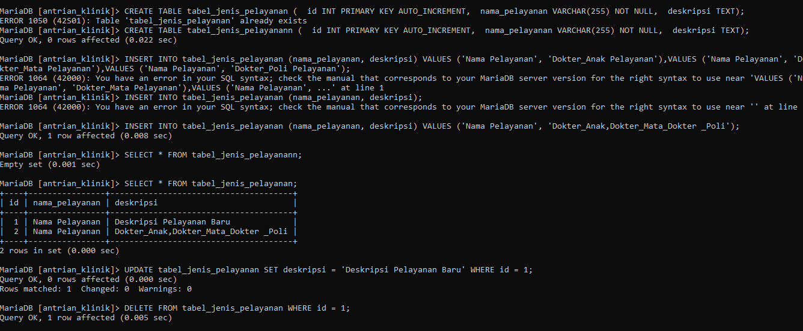

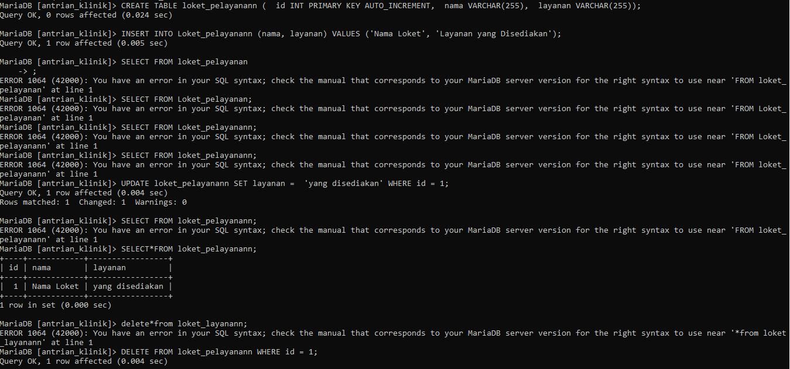

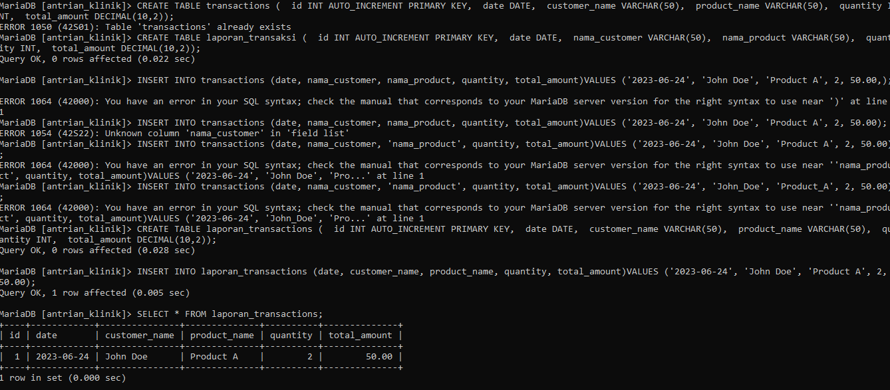

# SQL JOIN

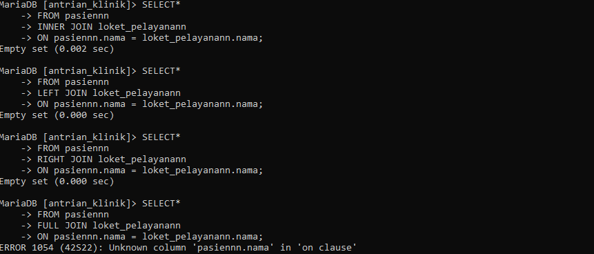
