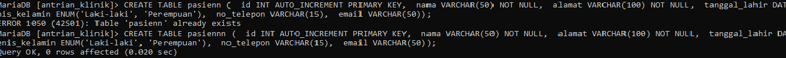
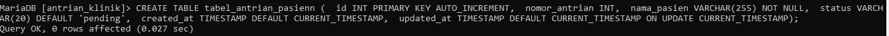
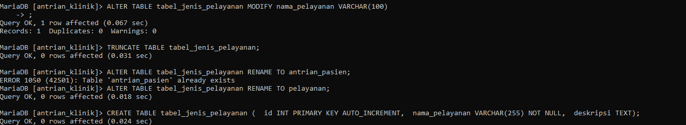
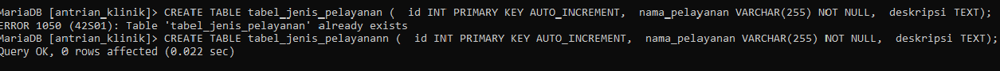
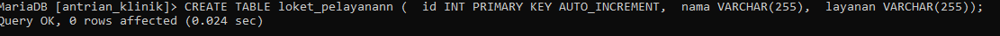
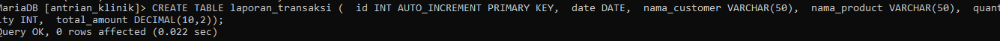
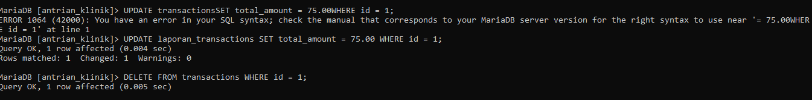

# TUGAS KELOMPOK BASIS DATA( ANTRIAN PASIEN KLINIK)

# NAMA ANGGOTA KELOMPOK 

- Abiyanfaras Danuyasa (312210103 )
- Birrham Efendi Lubis ( 312210272 )
- Najwa Iffa Fadhila ( 312210275 )
- Hafidza Dafariz Mujizat ( 312210276)
- Muhammad Zidan Fadillah (312210277)

 # UNIVERSITAS PELITA BANGSA FAKULTAS TEKNIK TEKNIK INFORMATIKA TAHUN AKADEMIK 2022/2023

# Hal yang perlu dibuat : 
• ER-D (312210277 / Muhammad Zidan Fadillah) 

• DDL (312210103 / Abiyanfaras Danuyasa )

• SQL CRUD (312210272 / Birrham Efendi Lubis) , (312210276) / Najwa Iffa Fadhila)
           
• SQL JOIN (312210275) / Hafidza Dafariz Mujizat)

# ERD 

# DLL

# SQL CURD

# SQL JOIN

